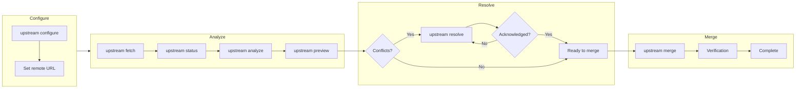

# Phase 9: Documentation - Research

**Researched:** 2026-03-10
**Domain:** Technical documentation, Mermaid diagrams, user guide writing
**Confidence:** HIGH

## Summary

Phase 9 documents the upstream sync features implemented in Phases 5-8 for GSD fork maintainers. The documentation requirements span four distinct deliverables: (1) a user guide section explaining the `/gsd:sync-upstream` command workflow with practical examples, (2) architecture documentation with Mermaid diagrams showing the sync flow, (3) README additions under the existing "GSD Enhancements" section, and (4) a troubleshooting guide covering common sync issues and recovery steps.

The existing documentation infrastructure provides clear patterns to follow. The `docs/USER-GUIDE.md` file already has sections for GSD Enhancements (currently covering worktree isolation), command reference tables, workflow diagrams (ASCII art), and troubleshooting entries. The README.md has a "GSD Enhancements" section with Worktree Isolation documented. The phase should extend these existing sections rather than creating parallel documentation structures.

The upstream sync implementation is mature and well-tested across Phases 5-8. Key commands to document include `upstream configure`, `upstream fetch`, `upstream status`, `upstream log`, `upstream analyze`, `upstream preview`, `upstream resolve`, `upstream merge`, `upstream abort`, `sync explore`, and `sync apply-suggestion`. The documentation must explain the complete workflow from configuration through merge, including the safety features (backup branches, rollback, post-merge verification).

**Primary recommendation:** Extend existing USER-GUIDE.md sections (GSD Enhancements, Command Reference, Troubleshooting) rather than creating new files; use Mermaid flowchart diagrams for sync flow visualization; keep README.md additions concise with links to full documentation.

<phase_requirements>
## Phase Requirements

| ID | Description | Research Support |
|----|-------------|-----------------|
| DOC-01 | User guide documents /gsd:sync-upstream command usage | Extend USER-GUIDE.md "GSD Enhancements" section; add workflow diagram and command table |
| DOC-02 | Architecture documentation includes mermaid diagrams for sync flow | Create Mermaid flowchart and sequence diagrams; may add to USER-GUIDE.md or new architecture section |
| DOC-03 | README documents upstream sync features under GSD Enhancements | Add "Upstream Sync" subsection after existing "Worktree Isolation" in README.md |
| DOC-04 | Troubleshooting guide covers common sync issues and recovery | Extend USER-GUIDE.md "Troubleshooting" section with sync-specific entries |
</phase_requirements>

## Standard Stack

### Core

| Tool | Version | Purpose | Why Standard |
|------|---------|---------|--------------|
| Markdown | CommonMark | Documentation format | Universal support, GitHub rendering, existing project convention |
| Mermaid | 10.x+ | Diagram generation | GitHub native rendering, text-based (version control friendly) |

### Supporting

| Tool | Purpose | When to Use |
|------|---------|-------------|
| ASCII art | Simple flow diagrams | When Mermaid is overkill; match existing USER-GUIDE.md patterns |
| Tables | Command reference, feature lists | Consistent with existing documentation style |
| Code blocks | Command examples, output samples | Essential for technical documentation |

### Alternatives Considered

| Instead of | Could Use | Tradeoff |
|------------|-----------|----------|
| Mermaid | ASCII diagrams | ASCII is simpler but less readable for complex flows; Mermaid better for sync flow |
| Mermaid | External image files | Images harder to maintain/update; Mermaid is version-control friendly |
| USER-GUIDE.md extension | Separate sync guide | Creates doc fragmentation; better to keep consolidated |

**Installation:**
```bash
# No installation needed - Mermaid renders natively on GitHub
```

## Architecture Patterns

### Recommended Documentation Structure

```
docs/
└── USER-GUIDE.md           # Extend existing sections
    ├── ## GSD Enhancements  # Add Upstream Sync subsection
    ├── ## Command Reference # Add sync commands to table
    └── ## Troubleshooting   # Add sync-specific entries

README.md                    # Add Upstream Sync to GSD Enhancements
```

### Pattern 1: Mermaid Flowchart for Sync Flow

**What:** Use Mermaid flowchart syntax to visualize the upstream sync workflow.
**When to use:** DOC-02 architecture documentation requirement.
**Example:**
```markdown
\`\`\`mermaid
flowchart TD
    A[gsd-tools upstream configure] --> B{Upstream configured?}
    B -->|No| C[Set remote URL]
    B -->|Yes| D[gsd-tools upstream fetch]
    D --> E[gsd-tools upstream status]
    E --> F{Commits behind?}
    F -->|No| G[Up to date]
    F -->|Yes| H[gsd-tools upstream analyze]
    H --> I[gsd-tools upstream preview]
    I --> J{Conflicts?}
    J -->|Yes| K[gsd-tools upstream resolve]
    K --> L{All acknowledged?}
    L -->|No| K
    L -->|Yes| M[gsd-tools upstream merge]
    J -->|No| M
    M --> N[Post-merge verification]
    N --> O{Tests pass?}
    O -->|Yes| P[Sync complete]
    O -->|No| Q[Rollback prompt]
\`\`\`
```

### Pattern 2: Command Reference Tables

**What:** Consistent table format matching existing USER-GUIDE.md style.
**When to use:** All command documentation.
**Example:**
```markdown
| Command | What it does |
|---------|--------------|
| `/gsd:sync-analyze` | Show upstream commits grouped by directory or feature |
| `/gsd:sync-preview` | Preview merge conflicts and risk assessment |
| `/gsd:sync-resolve` | Address structural conflicts before merge |
```

### Pattern 3: Troubleshooting Entry Format

**What:** Problem-solution format matching existing Troubleshooting section.
**When to use:** DOC-04 troubleshooting requirement.
**Example:**
```markdown
### "Upstream not configured"

You need to configure the upstream remote before using sync commands. Run:

\`\`\`bash
gsd-tools upstream configure <url>
\`\`\`

If you have an existing `upstream` remote in git, it will be auto-detected.
```

### Anti-Patterns to Avoid

- **Duplicating information:** Don't repeat the same content in README and USER-GUIDE; README should summarize with link to details
- **Over-documenting implementation:** Focus on user-facing behavior, not internal code structure
- **Stale examples:** Use actual gsd-tools commands that can be verified against current implementation

## Don't Hand-Roll

| Problem | Don't Build | Use Instead | Why |
|---------|-------------|-------------|-----|
| Flow diagrams | ASCII art for complex flows | Mermaid flowcharts | Better readability, native GitHub support |
| Screenshot generation | Manual screenshots | Text-based command examples | Screenshots go stale; text stays current |
| API documentation | Manual function docs | Reference existing command .md files | Commands already documented in commands/gsd/*.md |

**Key insight:** Documentation should be maintainable. Text-based diagrams (Mermaid) and command examples that can be copy-pasted are more valuable than polished but hard-to-update visuals.

## Common Pitfalls

### Pitfall 1: Documentation Drift
**What goes wrong:** Documentation becomes stale as code evolves.
**Why it happens:** Documentation lives separately from implementation.
**How to avoid:** Reference actual command files (`commands/gsd/*.md`) for command behavior; keep examples minimal and verifiable.
**Warning signs:** Examples that don't match actual command output.

### Pitfall 2: Over-Complexity in Diagrams
**What goes wrong:** Diagrams become unreadable by trying to show everything.
**Why it happens:** Attempting to document all code paths.
**How to avoid:** Focus on the primary happy path; note exceptions in text. Keep diagrams to 10-15 nodes maximum.
**Warning signs:** Diagrams that need scrolling, multiple crossing lines.

### Pitfall 3: Missing Context for New Users
**What goes wrong:** Documentation assumes knowledge that new users don't have.
**Why it happens:** Authors are too close to the implementation.
**How to avoid:** Include "When to Use" context; link to prerequisite commands; explain the "why" not just "how."
**Warning signs:** "How do I know when to use X?" questions.

### Pitfall 4: Inconsistent Style
**What goes wrong:** New documentation doesn't match existing style.
**Why it happens:** Not reviewing existing patterns before writing.
**How to avoid:** Study USER-GUIDE.md patterns before writing; match heading levels, table formats, code block style.
**Warning signs:** Visual inconsistency when comparing sections.

## Code Examples

### Command Reference Entry (from existing USER-GUIDE.md pattern)

```markdown
| `/gsd:sync-analyze` | Show upstream commits grouped by directory or feature |
| `/gsd:sync-preview` | Preview merge conflicts and risk assessment before sync |
| `/gsd:sync-resolve` | Address structural conflicts (renames/deletes) |
```

### GSD Enhancements Section Entry (from README.md pattern)

```markdown
### Upstream Sync (v1.1)

**Stay current with upstream while preserving fork customizations** - sync tooling that makes fork maintenance painless.

| Feature | Description |
|---------|-------------|
| **Fetch & Status** | See commits behind upstream without modifying local branches |
| **Commit Analysis** | View changes grouped by directory or conventional commit type |
| **Conflict Preview** | Predict merge conflicts with risk scoring before sync |
| **Safe Merge** | Automatic backup branch, atomic rollback on failure |
| **Post-Merge Verification** | Run tests on fork-modified files to catch regressions |

**New Commands:**

| Command | What it does |
|---------|--------------|
| `/gsd:sync-analyze` | Show upstream commits grouped by feature or directory |
| `/gsd:sync-preview` | Preview conflicts and binary changes |
| `/gsd:sync-resolve` | Address structural conflicts before merge |
```

### Workflow Diagram (Mermaid Flowchart)



### Troubleshooting Entry (from USER-GUIDE.md pattern)

```markdown
### Sync aborted unexpectedly

If a sync was interrupted (terminal closed, crash), you may have incomplete state. Check with:

\`\`\`bash
gsd-tools upstream abort --status
\`\`\`

If a merge is in progress, abort it:

\`\`\`bash
gsd-tools upstream abort
\`\`\`

To restore from a backup branch:

\`\`\`bash
gsd-tools upstream abort --restore backup/pre-sync-YYYY-MM-DD-HHMMSS
\`\`\`
```

## State of the Art

| Old Approach | Current Approach | When Changed | Impact |
|--------------|------------------|--------------|--------|
| External image diagrams | Mermaid text diagrams | ~2020 | Version control friendly, easier updates |
| Monolithic README | README + detailed USER-GUIDE | GSD 1.x | Better organization, appropriate detail levels |
| Manual changelog | Conventional commits + automated release notes | ~2022 | More reliable, less maintenance |

**Deprecated/outdated:**
- Static image diagrams: Hard to update, not version-control friendly; use Mermaid instead
- Separate per-feature documentation files: Creates fragmentation; extend existing USER-GUIDE.md

## Open Questions

1. **Mermaid diagram placement**
   - What we know: GitHub renders Mermaid natively in .md files
   - What's unclear: Whether diagrams should be inline in USER-GUIDE.md or in separate architecture section
   - Recommendation: Inline in USER-GUIDE.md under "Upstream Sync Workflow" subsection for discoverability

2. **Level of API documentation**
   - What we know: Commands are documented in commands/gsd/*.md; gsd-tools CLI has its own help
   - What's unclear: Whether internal functions (upstream.cjs exports) need separate API docs
   - Recommendation: No internal API docs needed; focus on user-facing commands. Power users can read source.

## Content Inventory

### Commands to Document

| Command | Location | Existing Doc |
|---------|----------|--------------|
| `upstream configure` | gsd-tools CLI | No command file |
| `upstream fetch` | gsd-tools CLI | No command file |
| `upstream status` | gsd-tools CLI | No command file |
| `upstream log` | gsd-tools CLI | No command file |
| `upstream analyze` | gsd-tools CLI | commands/gsd/sync-analyze.md |
| `upstream preview` | gsd-tools CLI | commands/gsd/sync-preview.md |
| `upstream resolve` | gsd-tools CLI | commands/gsd/sync-resolve.md |
| `upstream merge` | gsd-tools CLI | No command file |
| `upstream abort` | gsd-tools CLI | No command file |
| `sync explore` | gsd-tools CLI | No command file |
| `sync apply-suggestion` | gsd-tools CLI | No command file |

### Features to Document

| Feature | From Phase | Key Points |
|---------|------------|------------|
| Remote configuration | Phase 5 | Auto-detect from existing remotes, validation |
| Fetch with cache | Phase 5 | 24-hour cache, network failure handling |
| Status display | Phase 5 | Commits behind, last fetch date |
| Commit grouping | Phase 6 | By directory (default) or by conventional type |
| Conflict preview | Phase 6 | Risk scoring (EASY/MODERATE/HARD), merge-tree |
| Binary detection | Phase 6 | Safe/review/dangerous categories |
| Structural conflicts | Phase 6 | Rename detection, acknowledgment workflow |
| Backup branches | Phase 7 | Automatic creation, UTC timestamps |
| Atomic merge | Phase 7 | Rollback on failure |
| Abort/restore | Phase 7 | Clean state recovery |
| Sync history | Phase 7 | STATE.md logging |
| Interactive explore | Phase 8 | REPL with structured queries |
| Refactoring suggestions | Phase 8 | Semantic similarity detection |
| Post-merge verification | Phase 8 | Test discovery, rollback prompt |
| Worktree guards | Phase 8 | Hard block with active worktrees |
| Health check integration | Phase 8 | Stale sync detection |

## Sources

### Primary (HIGH confidence)
- `/Users/mauricevandermerwe/Projects/get-shit-done/docs/USER-GUIDE.md` - Existing documentation patterns and structure
- `/Users/mauricevandermerwe/Projects/get-shit-done/README.md` - GSD Enhancements section pattern
- `/Users/mauricevandermerwe/Projects/get-shit-done/get-shit-done/bin/lib/upstream.cjs` - Implementation details for accurate documentation
- `/Users/mauricevandermerwe/Projects/get-shit-done/commands/gsd/sync-*.md` - Existing command documentation

### Secondary (MEDIUM confidence)
- [Mermaid.js Official Documentation](https://mermaid.js.org/intro/syntax-reference.html) - Diagram syntax reference
- [GitHub Mermaid Support](https://github.blog/2022-02-14-include-diagrams-markdown-files-mermaid/) - GitHub rendering capabilities

### Tertiary (LOW confidence)
- Web search on Mermaid best practices - General guidance, needs verification against project needs

## Metadata

**Confidence breakdown:**
- Documentation patterns: HIGH - Based on direct analysis of existing USER-GUIDE.md and README.md
- Feature inventory: HIGH - Based on direct reading of upstream.cjs implementation
- Mermaid syntax: MEDIUM - Based on official docs, not tested in this project context

**Research date:** 2026-03-10
**Valid until:** 2026-04-10 (30 days - documentation is stable domain)
