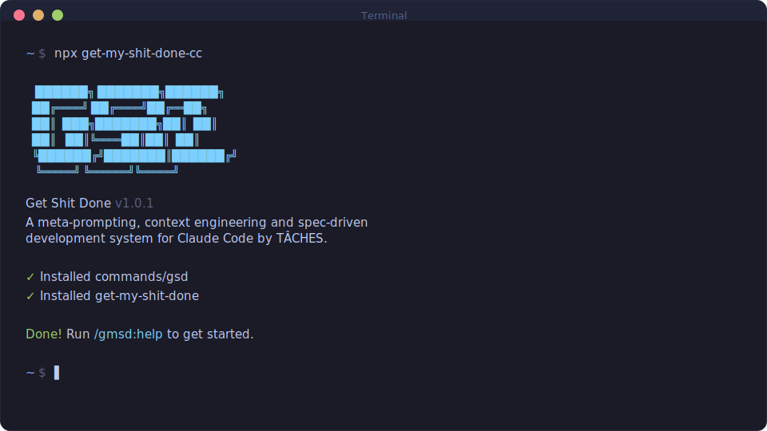

<div align="center">

# GET SHIT DONE

[English](README.md) · [Português](README.pt-BR.md) · [简体中文](README.zh-CN.md) · [日本語](README.ja-JP.md) · [한국어](README.ko-KR.md) · **Русский**

**Лёгкая система мета-промптинга, контекстной инженерии и spec-driven разработки для Claude Code, OpenCode, Gemini CLI, Kilo, Codex, Copilot, Cursor, Windsurf и других.**

**Решает «context rot» — деградацию качества, которая происходит по мере заполнения контекстного окна AI.**

[](https://www.npmjs.com/package/get-shit-done-cc)
[](https://www.npmjs.com/package/get-shit-done-cc)
[](https://github.com/gsd-build/get-shit-done/actions/workflows/test.yml)
[](https://discord.gg/mYgfVNfA2r)
[](https://x.com/gsd_foundation)
[](https://dexscreener.com/solana/dwudwjvan7bzkw9zwlbyv6kspdlvhwzrqy6ebk8xzxkv)
[](https://github.com/gsd-build/get-shit-done)
[](LICENSE)

<br>

```bash
npx get-shit-done-cc@latest
```

**Работает на Mac, Windows и Linux.**

<br>



<br>

*«Если ты чётко знаешь, что хочешь — эта штука это построит. Без воды.»*

*«Я пробовал SpecKit, OpenSpec и Taskmaster — у меня лучшие результаты дала именно эта.»*

*«Самое мощное дополнение к моему Claude Code. Ничего переусложнённого. Просто делает дело.»*

<br>

**Используется инженерами Amazon, Google, Shopify и Webflow.**

</div>

---

> [!IMPORTANT]
> **Возвращаешься в GSD?**
>
> Запусти `/gsd-map-codebase` чтобы переиндексировать кодовую базу, потом `/gsd-new-project` чтобы пересобрать планировочный контекст GSD. С кодом всё в порядке — GSD просто нужно восстановить свой контекст. Что нового — смотри в [CHANGELOG](CHANGELOG.md).

---

## Зачем я это построил

Я разработчик-одиночка. Я не пишу код — Claude Code пишет.

Другие spec-driven инструменты существуют, но все они построены под инженерные команды из 50 человек — sprint-ритуалы, story points, синхронизации со стейкхолдерами, Jira-воркфлоу. Я не такой. Я творческий человек, который пытается стабильно делать классные вещи.

Поэтому я построил GSD. Сложность — в системе, а не в твоём воркфлоу. За кулисами: контекстная инженерия, форматирование промптов через XML, оркестрация субагентов, управление состоянием. Что видишь ты — несколько команд, которые просто работают.

Система даёт Claude всё, что нужно, чтобы сделать работу *и* её проверить. Я доверяю воркфлоу. Он просто хорошо делает своё дело.

— **TÂCHES**

---

## Как это работает

Цикл — это шесть команд. Каждая делает ровно одну вещь.

### 1. Инициализация

```bash
/gsd-new-project
```

Вопросы → исследование → требования → дорожная карта. Ты её утверждаешь — и можно строить.

> **Уже есть код?** Сначала запусти `/gsd-map-codebase`. Он проанализирует твой стек, архитектуру и конвенции, чтобы `/gsd-new-project` задавал правильные вопросы.

### 2. Обсуждение

```bash
/gsd-discuss-phase 1
```

В дорожной карте на каждую фазу — одно предложение. Этого мало, чтобы построить её так, как видишь *ты*. Discuss фиксирует твои решения до начала планирования: лейауты, форма API, обработка ошибок, структуры данных — все серые зоны конкретно этой фазы.

Результат напрямую идёт в исследование и планирование. Пропустишь — получишь разумные дефолты. Используешь — получишь свою картину.

### 3. Планирование

```bash
/gsd-plan-phase 1
```

Исследование → план → верификация, в цикле пока планы не пройдут проверку. Каждый план достаточно мал, чтобы выполнить его в свежем контекстном окне.

### 4. Выполнение

```bash
/gsd-execute-phase 1
```

Планы исполняются параллельными волнами. У каждого исполнителя — свежий контекст на 200k токенов. У каждой задачи — свой атомарный коммит. Уходишь, возвращаешься — работа сделана, история коммитов чистая.

Твоё основное контекстное окно держится на 30–40%. Работа идёт в субагентах.

### 5. Верификация

```bash
/gsd-verify-work 1
```

Пройдись по тому, что построено. Всё, что сломано, получает диагностированный план починки — готовый к немедленному перезапуску. Ты не дебажишь руками — ты просто запускаешь execute снова.

### 6. Повтор → Релиз

```bash
/gsd-ship 1
/gsd-complete-milestone
/gsd-new-milestone
```

Гоняй discuss → plan → execute → verify → ship, пока майлстоун не закроется. Потом архивируешь, тегаешь и начинаешь следующий с чистого листа.

---

## Начало работы

```bash
npx get-shit-done-cc@latest
```

Установщик спросит про твой рантайм (Claude Code, OpenCode, Gemini CLI, Kilo, Codex, Copilot, Cursor, Windsurf и др.) и хочешь ли ты ставить глобально или локально.

```bash
claude --dangerously-skip-permissions
```

GSD заточен под безбарьерную автоматизацию. Skip-permissions — это режим, в котором он и задуман работать.

Поставь только нужные скиллы через `--profile=core` (шесть core-скиллов основного цикла), `--profile=standard` (core + управление фазами) или дефолтную полную установку. Профили комбинируются: `--profile=core,audit`. `--minimal` — это псевдоним для `--profile=core`. Полный гайд, неинтерактивные флаги установки для всех 15 рантаймов и настройка прав — в **[docs/USER-GUIDE.md](docs/USER-GUIDE.md)**. Про модель профилей и контроль рантайма — в [ADR-0011](docs/adr/0011-skill-surface-budget-module.md).

---

## Команды

Основной цикл:

| Команда | Что делает |
|---------|------------|
| `/gsd-new-project` | Вопросы → исследование → требования → дорожная карта |
| `/gsd-discuss-phase [N]` | Зафиксировать решения по реализации до планирования |
| `/gsd-plan-phase [N]` | Исследование + план + верификация |
| `/gsd-execute-phase <N>` | Исполнить планы параллельными волнами |
| `/gsd-verify-work [N]` | Ручное приёмочное тестирование |
| `/gsd-ship [N]` | Создать PR из проверенной работы фазы |
| `/gsd-progress --next` | Авто-определить и запустить следующий шаг |
| `/gsd-complete-milestone` | Заархивировать майлстоун и затегать релиз |
| `/gsd-new-milestone` | Начать следующую версию |
| `/gsd:surface` | Включать/выключать кластеры скиллов в рантайме без переустановки |

Для разовых задач, автономного режима, анализа кодовой базы, форензики и полного списка команд — смотри **[docs/COMMANDS.md](docs/COMMANDS.md)**.

---

## Почему это работает

Три вещи, которые большинство AI-инструментов для кода делают неправильно:

**1. Раздутый контекст.** По мере роста сессии качество падает. GSD держит твой основной контекст чистым, выполняя тяжёлую работу в свежих контекстах субагентов. Исследователи, планировщики и исполнители каждый раз стартуют с нуля — ровно с тем, что им нужно.

**2. Нет общей памяти.** GSD ведёт структурированные артефакты, которые переживают границы сессий: `PROJECT.md` (видение), `REQUIREMENTS.md` (объём), `ROADMAP.md` (куда идём), `STATE.md` (где сейчас и принятые решения), `CONTEXT.md` (решения по реализации на каждую фазу). Каждая новая сессия их подгружает и точно знает, где что.

**3. Нет верификации.** Код, который «запускается» — это не код, который «работает». Шаг verify в GSD проводит тебя по построенному, диагностирует сбои выделенными debug-агентами и генерирует планы починки до того, как ты объявишь фазу готовой.

Как устроена мультиагентная оркестрация и контекстная инженерия в деталях — смотри **[docs/ARCHITECTURE.md](docs/ARCHITECTURE.md)**.

---

## Конфигурация

Настройки живут в `.planning/config.json`. Сконфигурируешь в ходе `/gsd-new-project` или обновишь через `/gsd-settings`.

Главные ручки:

| Настройка | Чем управляет |
|-----------|---------------|
| `mode` | `interactive` (подтверждать каждый шаг) или `yolo` (автоодобрение) |
| Профили моделей | `quality` / `balanced` / `budget` — какая модель используется каждым агентом |
| `workflow.research` / `plan_check` / `verifier` | Включать/выключать quality-агентов, которые добавляют токены и время |
| `parallelization.enabled` | Запускать независимые планы одновременно |

Опциональный структурный ревью: поставь `code_quality.fallow.enabled` в `true`, чтобы добавить fallow-предпроход к `/gsd-code-review`. GSD пишет `.planning/phases/<phase>/FALLOW.json` и добавляет секцию `Structural Findings (fallow)` в `REVIEW.md`. Установка: `npm install -D fallow@^2.70.0` (или системно через `cargo install fallow`; важно: JSON-схема Rust-бинарника должна совпадать с задокументированным контрактом v2.70+ — старые версии могут молча выдавать ноль находок).

Полный справочник конфигурации — все настройки, стратегии git-ветвления, override моделей под рантайм, наследование конфига workstream'ов, инъекция скиллов агентов — в **[docs/CONFIGURATION.md](docs/CONFIGURATION.md)**.

---

## Документация

| Документ | Что внутри |
|----------|------------|
| [User Guide](docs/USER-GUIDE.md) | Сквозной разбор, опции установки, флаги всех рантаймов, справочник конфигурации |
| [Commands](docs/COMMANDS.md) | Каждая команда с флагами и примерами |
| [Configuration](docs/CONFIGURATION.md) | Полная схема конфига, профили моделей, git-ветвление |
| [Architecture](docs/ARCHITECTURE.md) | Как работает мультиагентная оркестрация |
| [CLI Tools](docs/CLI-TOOLS.md) | `gsd-sdk query` и программные SDK-диспетчеры |
| [Features](docs/FEATURES.md) | Полный индекс фич |
| [Changelog](CHANGELOG.md) | Что менялось в каждом релизе |

---

## Решение проблем

**Команды не появляются?** Перезапусти рантайм после установки. GSD ставится в `~/.claude/skills/gsd-*/` (Claude Code), `~/.codex/skills/gsd-*/` (Codex) или эквивалент для твоего рантайма.

**Что-то сломалось?** Перезапусти установщик — он идемпотентен:
```bash
npx get-shit-done-cc@latest
```

**Контейнеры или Docker?** Установи `CLAUDE_CONFIG_DIR` перед установкой, чтобы избежать проблем с тильда-расширением:
```bash
CLAUDE_CONFIG_DIR=/home/youruser/.claude npx get-shit-done-cc --global
```

Полное руководство по диагностике и удалению — в **[docs/USER-GUIDE.md](docs/USER-GUIDE.md#troubleshooting)**.

---

## Сообщество

| Проект | Платформа |
|--------|-----------|
| [gsd-opencode](https://github.com/rokicool/gsd-opencode) | Оригинальный порт под OpenCode |
| [Discord](https://discord.gg/mYgfVNfA2r) | Поддержка сообщества |

---

## История звёзд

<a href="https://star-history.com/#gsd-build/get-shit-done&Date">
 <picture>
   <source media="(prefers-color-scheme: dark)" srcset="https://api.star-history.com/svg?repos=gsd-build/get-shit-done&type=Date&theme=dark" />
   <source media="(prefers-color-scheme: light)" srcset="https://api.star-history.com/svg?repos=gsd-build/get-shit-done&type=Date" />
   
 </picture>
</a>

---

## Лицензия

MIT License. Подробности — в [LICENSE](LICENSE).

---

<div align="center">

**Claude Code мощный. GSD делает его надёжным.**

</div>
